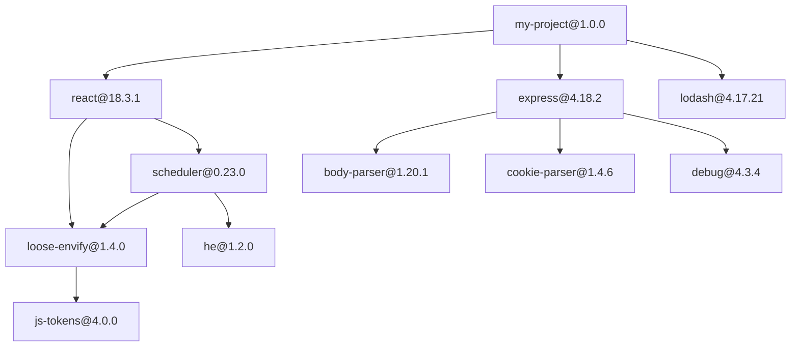
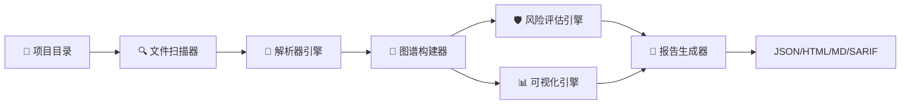
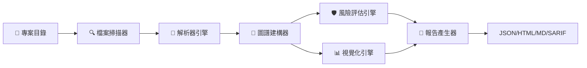
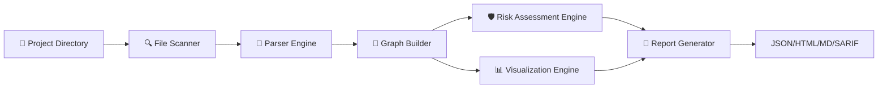

<p align="center">
  <a href="#简体中文">简体中文</a> ·
  <a href="#繁體中文">繁體中文</a> ·
  <a href="#english">English</a>
</p>

---

<h1 align="center">
  
  
  
  
</h1>

<p align="center">
  <strong>DepGraph</strong> — 轻量级 Git 仓库依赖图谱与供应链风险智能分析引擎<br/>
  <em>零外部依赖 · 9 种依赖文件解析 · 可视化图谱 · 供应链风险评估</em>
</p>

<p align="center">
  <a href="https://github.com/gitstq/DepGraph">GitHub 仓库</a> ·
  <a href="https://github.com/gitstq/DepGraph/issues">问题反馈</a> ·
  <a href="#快速开始">快速开始</a>
</p>

---

<a name="简体中文"></a>

# 简体中文

## 项目介绍

> **"看清你的依赖，守住你的供应链。"**

**DepGraph** 是一款专为开发者打造的轻量级依赖分析工具。它能自动扫描项目中的依赖文件，构建完整的依赖关系图谱，并对供应链安全风险进行智能评估。

在当今软件供应链攻击频发的时代，了解你的项目依赖了什么、这些依赖又依赖了什么、是否存在已知的安全风险，已经不再是"锦上添花"，而是**必不可少的安全实践**。DepGraph 正是为了解决这一问题而生。

### 为什么选择 DepGraph？

| 特性 | DepGraph | 其他工具 |
|------|----------|----------|
| **外部依赖** | 零依赖，纯标准库实现 | 通常需要 Node.js / Java 运行时 |
| **支持语言** | 9 种主流依赖文件格式 | 多数仅支持 1-2 种 |
| **安装方式** | 一行 pip 命令 | 需要下载二进制或复杂配置 |
| **可视化** | 终端树形图 + Mermaid + HTML 交互报告 | 多数仅输出文本 |
| **风险评估** | 内置许可证合规 + 新鲜度评分 + 深度分析 | 需额外付费服务 |
| **跨平台** | Windows / macOS / Linux 全平台支持 | 部分工具平台受限 |

---

## 核心特性

### 1. 多语言依赖文件解析

DepGraph 支持当前主流的 **9 种** 依赖文件格式，覆盖绝大多数开发场景：

| 语言/生态 | 依赖文件 | 状态 |
|-----------|----------|------|
| Node.js | `package.json` | ✅ 完整支持 |
| Python | `requirements.txt` | ✅ 完整支持 |
| Python (现代) | `pyproject.toml` | ✅ 完整支持 |
| Go | `go.mod` | ✅ 完整支持 |
| Rust | `Cargo.toml` | ✅ 完整支持 |
| Java (Maven) | `pom.xml` | ✅ 完整支持 |
| Java (Gradle) | `build.gradle` | ✅ 完整支持 |
| Ruby | `Gemfile` | ✅ 完整支持 |
| PHP | `composer.json` | ✅ 完整支持 |

### 2. 依赖关系图谱构建

- **邻接表表示**：高效存储和查询依赖关系
- **拓扑排序**：确定依赖加载顺序，检测循环依赖
- **环检测**：自动发现并报告循环依赖问题
- **传递依赖计算**：递归解析所有间接依赖

### 3. 供应链风险评估

- **许可证合规检测**：自动识别依赖的许可证类型，标记高风险许可证（如 GPL 系列）
- **依赖新鲜度评分**：基于发布时间、版本号、维护活跃度等多维度评估依赖的健康状态
- **依赖深度分析**：计算依赖链的最大深度和平均深度，识别过深的依赖树
- **重复依赖检测**：发现同一包的不同版本共存问题，提示潜在的版本冲突

### 4. 依赖变更检测

对比 lock 文件与声明文件的差异，精准输出：
- **新增依赖**：新引入的包及版本
- **删除依赖**：被移除的包
- **版本变更**：升级或降级的依赖及具体版本变化

### 5. 多种可视化输出

- **终端彩色树形图**：直观展示依赖层级关系，支持颜色编码
- **Mermaid 图**：可在 GitHub / GitLab / Notion 等平台直接渲染
- **HTML 交互报告**：浏览器中打开，支持搜索、过滤、展开折叠

### 6. 多格式报告导出

| 格式 | 用途 |
|------|------|
| **JSON** | 机器可读，便于 CI/CD 集成 |
| **HTML** | 人类可读，适合团队分享 |
| **Markdown** | 可直接嵌入项目文档 |
| **SARIF** | GitHub Code Scanning 原生支持 |

---

## 快速开始

### 环境要求

- **Python** 3.8 或更高版本
- **Git**（用于版本对比功能）
- **pip** 包管理器

> 💡 **提示**：DepGraph 零外部依赖，安装后即可使用，无需额外配置任何运行时环境。

### 安装

**方式一：从 PyPI 安装（推荐）**

```bash
pip install git+https://github.com/gitstq/DepGraph.git
```

**方式二：克隆仓库后本地安装**

```bash
git clone https://github.com/gitstq/DepGraph.git
cd DepGraph
pip install .
```

**方式三：开发模式安装（贡献者推荐）**

```bash
git clone https://github.com/gitstq/DepGraph.git
cd DepGraph
pip install -e .
```

### 验证安装

```bash
depgraph --version
# 输出: depgraph v1.0.0

depgraph --help
# 输出完整的帮助信息
```

### 三分钟上手

**第一步：扫描当前项目的依赖**

```bash
depgraph scan .
```

**第二步：生成风险分析报告**

```bash
depgraph report . -f html -o report.html
```

**第三步：查看可视化依赖图**

```bash
depgraph graph . -f tree
```

🎉 **恭喜！你已经完成了 DepGraph 的基本使用。**

---

## 详细使用指南

### `depgraph scan` — 依赖扫描

扫描指定路径下的所有依赖文件，输出解析结果。

```bash
# 扫描当前目录
depgraph scan .

# 扫描指定路径
depgraph scan /path/to/your/project

# 仅扫描特定类型的依赖文件
depgraph scan . --type python

# 输出详细信息（包含版本号和来源）
depgraph scan . --verbose
```

**终端输出示例：**

```
🔍 正在扫描项目依赖...

📦 发现 3 个依赖文件:
  ├─ 📄 package.json (Node.js)
  ├─ 📄 requirements.txt (Python)
  └─ 📄 go.mod (Go)

📊 依赖统计:
  ├─ 直接依赖: 24 个
  ├─ 传递依赖: 87 个
  ├─ 总依赖数: 111 个
  └─ ⚠️  发现 3 个潜在风险

✅ 扫描完成，耗时 0.42s
```

### `depgraph report` — 风险分析报告

生成详细的供应链风险分析报告。

```bash
# 生成 HTML 报告（推荐，最直观）
depgraph report . -f html -o report.html

# 生成 JSON 报告（适合 CI/CD 集成）
depgraph report . -f json -o report.json

# 生成 Markdown 报告（适合嵌入文档）
depgraph report . -f markdown -o report.md

# 生成 SARIF 报告（GitHub Code Scanning）
depgraph report . -f sarif -o report.sarif

# 指定输出目录
depgraph report . -f html -o ./reports/dependency-report.html
```

**HTML 报告截图占位：**

```
┌─────────────────────────────────────────────────────┐
│  🛡️ DepGraph 供应链风险分析报告                      │
│                                                     │
│  项目: my-awesome-project                            │
│  扫描时间: 2025-01-15 14:30:22                       │
│  依赖总数: 111  |  风险项: 3  |  评分: B+            │
│                                                     │
│  ┌─ 风险概览 ─────────────────────────────────────┐  │
│  │ 🔴 高风险: 1  🟡 中风险: 1  🟢 低风险: 1      │  │
│  └────────────────────────────────────────────────┘  │
│                                                     │
│  ┌─ 许可证合规 ───────────────────────────────────┐  │
│  │ ✅ MIT: 78 个  ✅ Apache-2.0: 21 个            │  │
│  │ ⚠️  GPL-3.0: 2 个  ❌ 未知: 10 个             │  │
│  └────────────────────────────────────────────────┘  │
└─────────────────────────────────────────────────────┘
```

### `depgraph diff` — 依赖变更检测

对比两个版本（或两个目录）之间的依赖变化。

```bash
# 对比两个目录
depgraph diff ./project-v1 ./project-v2

# 对比两个 Git 提交
depgraph diff HEAD~1 HEAD

# 对比两个分支
depgraph diff main feature/new-deps

# 仅显示版本变更
depgraph diff ./old ./new --filter version

# 仅显示新增依赖
depgraph diff ./old ./new --filter added
```

**变更检测输出示例：**

```
📋 依赖变更对比报告
━━━━━━━━━━━━━━━━━━━━━━━━━━━━━━━━━━━━━━━━━━

📦 新增依赖 (3):
  ✚ lodash@4.17.21
  ✚ axios@1.6.0
  ✚ dayjs@1.11.10

🗑️ 删除依赖 (1):
  ✖ moment@2.29.4

🔄 版本变更 (2):
  ↑ react: 18.2.0 → 18.3.1
  ↓ webpack: 5.89.0 → 5.88.2

━━━━━━━━━━━━━━━━━━━━━━━━━━━━━━━━━━━━━━━━━━
```

### `depgraph graph` — 依赖图谱可视化

生成依赖关系图谱，支持多种输出格式。

```bash
# 终端彩色树形图
depgraph graph . -f tree

# Mermaid 格式（可嵌入 Markdown）
depgraph graph . -f mermaid

# 输出到文件
depgraph graph . -f mermaid -o deps.mmd

# 限制显示深度
depgraph graph . -f tree --depth 3
```

**终端树形图输出示例：**

```
my-project@1.0.0
├── react@18.3.1
│   ├── loose-envify@1.4.0
│   │   └── js-tokens@4.0.0
│   └── scheduler@0.23.0
│       ├── loose-envify@1.4.0 (dup)
│       └── he@1.2.0
├── express@4.18.2
│   ├── body-parser@1.20.1
│   ├── cookie-parser@1.4.6
│   └── debug@4.3.4
└── lodash@4.17.21
```

**Mermaid 图示例：**



---

## 设计思路与迭代规划

### 架构设计理念

DepGraph 的核心设计理念是 **"简单即力量"**：

1. **零依赖哲学**：整个工具仅使用 Python 标准库，不引入任何第三方包。这意味着：
   - 安装速度极快（< 1 秒）
   - 不会与项目自身依赖产生冲突
   - 安全性更高（更小的攻击面）
   - 可在任何 Python 环境中运行

2. **插件化解析器**：每种依赖文件格式对应一个独立的解析器模块，新增格式只需添加一个解析器文件，无需修改核心逻辑。

3. **管道式处理**：扫描 → 解析 → 构建图谱 → 风险评估 → 输出，每个环节独立可测试。

4. **渐进式报告**：从简单的终端输出到复杂的 HTML 交互报告，用户按需选择。

### 数据流架构



### 迭代规划

| 版本 | 计划功能 | 状态 |
|------|----------|------|
| **v1.0.0** | 核心功能：9 种文件解析、图谱构建、风险评估、报告导出 | ✅ 当前版本 |
| **v1.1.0** | 新增 `yarn.lock` / `pnpm-lock.yaml` / `package-lock.json` 解析 | 🔜 规划中 |
| **v1.2.0** | 集成 OSV 数据库，支持已知漏洞（CVE）自动检测 | 📋 计划中 |
| **v1.3.0** | 支持 GitHub Actions / GitLab CI 原生集成 | 📋 计划中 |
| **v2.0.0** | Web UI 仪表盘，支持多项目集中管理 | 💡 构想中 |

---

## 打包与部署

### 使用 pip 打包

```bash
# 安装构建工具
pip install build

# 构建 sdist 和 wheel
python -m build

# 生成的文件在 dist/ 目录下
ls dist/
# depgraph-1.0.0.tar.gz
# depgraph-1.0.0-py3-none-any.whl
```

### 发布到 PyPI

```bash
# 安装 Twine
pip install twine

# 上传到 PyPI（推荐使用 TestPyPI 先测试）
twine upload dist/*
```

### Docker 部署

```dockerfile
FROM python:3.11-slim

WORKDIR /app
COPY . .

RUN pip install --no-cache-dir .

# 扫描挂载的项目目录
ENTRYPOINT ["depgraph"]
CMD ["scan", "/project"]
```

```bash
# 构建镜像
docker build -t depgraph:latest .

# 使用 Docker 运行
docker run -v /path/to/project:/project depgraph:latest report /project -f html -o /project/report.html
```

### CI/CD 集成示例

**GitHub Actions：**

```yaml
name: Dependency Analysis
on: [push, pull_request]

jobs:
  depgraph:
    runs-on: ubuntu-latest
    steps:
      - uses: actions/checkout@v4
      - uses: actions/setup-python@v5
        with:
          python-version: '3.11'
      - name: Install DepGraph
        run: pip install git+https://github.com/gitstq/DepGraph.git
      - name: Scan Dependencies
        run: depgraph report . -f sarif -o depgraph-report.sarif
      - name: Upload SARIF
        uses: github/codeql-action/upload-sarif@v3
        with:
          sarif_file: depgraph-report.sarif
```

---

## 贡献指南

我们欢迎并感谢每一位贡献者！无论你是提交 Bug 报告、改进文档，还是贡献代码，都是对项目的宝贵支持。

### 贡献流程

1. **Fork** 本仓库
2. 创建特性分支：`git checkout -b feature/your-feature-name`
3. 提交更改：`git commit -m "feat: 添加 xxx 功能"`
4. 推送分支：`git push origin feature/your-feature-name`
5. 提交 **Pull Request**

### 提交规范

我们采用 [Conventional Commits](https://www.conventionalcommits.org/) 规范：

```
feat: 新增 xxx 功能
fix: 修复 xxx 问题
docs: 更新 xxx 文档
style: 调整 xxx 代码格式
refactor: 重构 xxx 模块
test: 补充 xxx 测试用例
chore: 更新 xxx 构建配置
```

### 开发环境搭建

```bash
git clone https://github.com/gitstq/DepGraph.git
cd DepGraph
pip install -e ".[dev]"

# 运行测试
pytest tests/

# 代码格式检查
flake8 src/
```

### 行为准则

- 尊重每一位贡献者
- 保持友好和包容的交流态度
- 关注代码质量和可维护性
- 编写充分的测试用例

---

## 开源协议

本项目基于 **[MIT License](https://opensource.org/licenses/MIT)** 开源。

```
MIT License

Copyright (c) 2025 DepGraph Contributors

Permission is hereby granted, free of charge, to any person obtaining a copy
of this software and associated documentation files (the "Software"), to deal
in the Software without restriction, including without limitation the rights
to use, copy, modify, merge, publish, distribute, sublicense, and/or sell
copies of the Software, and to permit persons to whom the Software is
furnished to do so, subject to the following conditions:

The above copyright notice and this permission notice shall be included in all
copies or substantial portions of the Software.

THE SOFTWARE IS PROVIDED "AS IS", WITHOUT WARRANTY OF ANY KIND, EXPRESS OR
IMPLIED, INCLUDING BUT NOT LIMITED TO THE WARRANTIES OF MERCHANTABILITY,
FITNESS FOR A PARTICULAR PURPOSE AND NONINFRINGEMENT. IN NO EVENT SHALL THE
AUTHORS OR COPYRIGHT HOLDERS BE LIABLE FOR ANY CLAIM, DAMAGES OR OTHER
LIABILITY, WHETHER IN AN ACTION OF CONTRACT, TORT OR OTHERWISE, ARISING FROM,
OUT OF OR IN CONNECTION WITH THE SOFTWARE OR THE USE OR OTHER DEALINGS IN THE
SOFTWARE.
```

---

<p align="center">
  用 ❤️ 打造 | <strong>DepGraph</strong> — 让依赖管理更透明、更安全
</p>

---
---

<a name="繁體中文"></a>

# 繁體中文

## 專案介紹

> **「看清你的依賴，守護你的供應鏈。」**

**DepGraph** 是一款專為開發者打造的輕量級依賴分析工具。它能自動掃描專案中的依賴檔案，建構完整的依賴關係圖譜，並對供應鏈安全風險進行智慧評估。

在當今軟體供應鏈攻擊頻發的時代，了解你的專案依賴了什麼、這些依賴又依賴了什麼、是否存在已知的安全風險，已經不再是「錦上添花」，而是**必不可少的安全實踐**。DepGraph 正是為了解決這一問題而生。

### 為什麼選擇 DepGraph？

| 特性 | DepGraph | 其他工具 |
|------|----------|----------|
| **外部依賴** | 零依賴，純標準函式庫實作 | 通常需要 Node.js / Java 執行環境 |
| **支援語言** | 9 種主流依賴檔案格式 | 多數僅支援 1-2 種 |
| **安裝方式** | 一行 pip 指令 | 需要下載二進位檔案或複雜配置 |
| **視覺化** | 終端樹狀圖 + Mermaid + HTML 互動報告 | 多數僅輸出純文字 |
| **風險評估** | 內建授權條款合規 + 新鮮度評分 + 深度分析 | 需額外付費服務 |
| **跨平台** | Windows / macOS / Linux 全平台支援 | 部分工具平台受限 |

---

## 核心特性

### 1. 多語言依賴檔案解析

DepGraph 支援當前主流的 **9 種** 依賴檔案格式，涵蓋絕大多數開發場景：

| 語言/生態系 | 依賴檔案 | 狀態 |
|-------------|----------|------|
| Node.js | `package.json` | ✅ 完整支援 |
| Python | `requirements.txt` | ✅ 完整支援 |
| Python (現代) | `pyproject.toml` | ✅ 完整支援 |
| Go | `go.mod` | ✅ 完整支援 |
| Rust | `Cargo.toml` | ✅ 完整支援 |
| Java (Maven) | `pom.xml` | ✅ 完整支援 |
| Java (Gradle) | `build.gradle` | ✅ 完整支援 |
| Ruby | `Gemfile` | ✅ 完整支援 |
| PHP | `composer.json` | ✅ 完整支援 |

### 2. 依賴關係圖譜建構

- **鄰接表表示**：高效儲存和查詢依賴關係
- **拓撲排序**：確定依賴載入順序，偵測循環依賴
- **環偵測**：自動發現並回報循環依賴問題
- **傳遞依賴計算**：遞迴解析所有間接依賴

### 3. 供應鏈風險評估

- **授權條款合規偵測**：自動識別依賴的授權條款類型，標記高風險條款（如 GPL 系列）
- **依賴新鮮度評分**：基於發佈時間、版本號、維護活躍度等多維度評估依賴的健康狀態
- **依賴深度分析**：計算依賴鏈的最大深度和平均深度，識別過深的依賴樹
- **重複依賴偵測**：發現同一套件的不同版本共存問題，提示潛在的版本衝突

### 4. 依賴變更偵測

對比 lock 檔案與宣告檔案的差異，精準輸出：
- **新增依賴**：新引入的套件及版本
- **刪除依賴**：被移除的套件
- **版本變更**：升級或降級的依賴及具體版本變化

### 5. 多種視覺化輸出

- **終端彩色樹狀圖**：直觀展示依賴層級關係，支援顏色編碼
- **Mermaid 圖**：可在 GitHub / GitLab / Notion 等平台直接渲染
- **HTML 互動報告**：瀏覽器中開啟，支援搜尋、篩選、展開摺疊

### 6. 多格式報告匯出

| 格式 | 用途 |
|------|------|
| **JSON** | 機器可讀，便於 CI/CD 整合 |
| **HTML** | 人類可讀，適合團隊分享 |
| **Markdown** | 可直接嵌入專案文件 |
| **SARIF** | GitHub Code Scanning 原生支援 |

---

## 快速開始

### 環境需求

- **Python** 3.8 或更高版本
- **Git**（用於版本對比功能）
- **pip** 套件管理器

> 💡 **提示**：DepGraph 零外部依賴，安裝後即可使用，無需額外配置任何執行環境。

### 安裝

**方式一：從 PyPI 安裝（推薦）**

```bash
pip install git+https://github.com/gitstq/DepGraph.git
```

**方式二：克隆倉庫後本機安裝**

```bash
git clone https://github.com/gitstq/DepGraph.git
cd DepGraph
pip install .
```

**方式三：開發模式安裝（貢獻者推薦）**

```bash
git clone https://github.com/gitstq/DepGraph.git
cd DepGraph
pip install -e .
```

### 驗證安裝

```bash
depgraph --version
# 輸出: depgraph v1.0.0

depgraph --help
# 輸出完整的說明資訊
```

### 三分鐘上手

**第一步：掃描目前專案的依賴**

```bash
depgraph scan .
```

**第二步：產生風險分析報告**

```bash
depgraph report . -f html -o report.html
```

**第三步：檢視視覺化依賴圖**

```bash
depgraph graph . -f tree
```

🎉 **恭喜！你已經完成了 DepGraph 的基本使用。**

---

## 詳細使用指南

### `depgraph scan` — 依賴掃描

掃描指定路徑下的所有依賴檔案，輸出解析結果。

```bash
# 掃描目前目錄
depgraph scan .

# 掃描指定路徑
depgraph scan /path/to/your/project

# 僅掃描特定類型的依賴檔案
depgraph scan . --type python

# 輸出詳細資訊（包含版本號和來源）
depgraph scan . --verbose
```

**終端輸出範例：**

```
🔍 正在掃描專案依賴...

📦 發現 3 個依賴檔案:
  ├─ 📄 package.json (Node.js)
  ├─ 📄 requirements.txt (Python)
  └─ 📄 go.mod (Go)

📊 依賴統計:
  ├─ 直接依賴: 24 個
  ├─ 傳遞依賴: 87 個
  ├─ 總依賴數: 111 個
  └─ ⚠️  發現 3 個潛在風險

✅ 掃描完成，耗時 0.42s
```

### `depgraph report` — 風險分析報告

產生詳細的供應鏈風險分析報告。

```bash
# 產生 HTML 報告（推薦，最直觀）
depgraph report . -f html -o report.html

# 產生 JSON 報告（適合 CI/CD 整合）
depgraph report . -f json -o report.json

# 產生 Markdown 報告（適合嵌入文件）
depgraph report . -f markdown -o report.md

# 產生 SARIF 報告（GitHub Code Scanning）
depgraph report . -f sarif -o report.sarif

# 指定輸出目錄
depgraph report . -f html -o ./reports/dependency-report.html
```

**HTML 報告截圖佔位：**

```
┌─────────────────────────────────────────────────────┐
│  🛡️ DepGraph 供應鏈風險分析報告                      │
│                                                     │
│  專案: my-awesome-project                            │
│  掃描時間: 2025-01-15 14:30:22                       │
│  依賴總數: 111  |  風險項: 3  |  評分: B+            │
│                                                     │
│  ┌─ 風險概覽 ─────────────────────────────────────┐  │
│  │ 🔴 高風險: 1  🟡 中風險: 1  🟢 低風險: 1      │  │
│  └────────────────────────────────────────────────┘  │
│                                                     │
│  ┌─ 授權條款合規 ─────────────────────────────────┐  │
│  │ ✅ MIT: 78 個  ✅ Apache-2.0: 21 個            │  │
│  │ ⚠️  GPL-3.0: 2 個  ❌ 未知: 10 個             │  │
│  └────────────────────────────────────────────────┘  │
└─────────────────────────────────────────────────────┘
```

### `depgraph diff` — 依賴變更偵測

對比兩個版本（或兩個目錄）之間的依賴變化。

```bash
# 對比兩個目錄
depgraph diff ./project-v1 ./project-v2

# 對比兩個 Git 提交
depgraph diff HEAD~1 HEAD

# 對比兩個分支
depgraph diff main feature/new-deps

# 僅顯示版本變更
depgraph diff ./old ./new --filter version

# 僅顯示新增依賴
depgraph diff ./old ./new --filter added
```

**變更偵測輸出範例：**

```
📋 依賴變更對比報告
━━━━━━━━━━━━━━━━━━━━━━━━━━━━━━━━━━━━━━━━━━

📦 新增依賴 (3):
  ✚ lodash@4.17.21
  ✚ axios@1.6.0
  ✚ dayjs@1.11.10

🗑️ 刪除依賴 (1):
  ✖ moment@2.29.4

🔄 版本變更 (2):
  ↑ react: 18.2.0 → 18.3.1
  ↓ webpack: 5.89.0 → 5.88.2

━━━━━━━━━━━━━━━━━━━━━━━━━━━━━━━━━━━━━━━━━━
```

### `depgraph graph` — 依賴圖譜視覺化

產生依賴關係圖譜，支援多種輸出格式。

```bash
# 終端彩色樹狀圖
depgraph graph . -f tree

# Mermaid 格式（可嵌入 Markdown）
depgraph graph . -f mermaid

# 輸出到檔案
depgraph graph . -f mermaid -o deps.mmd

# 限制顯示深度
depgraph graph . -f tree --depth 3
```

**終端樹狀圖輸出範例：**

```
my-project@1.0.0
├── react@18.3.1
│   ├── loose-envify@1.4.0
│   │   └── js-tokens@4.0.0
│   └── scheduler@0.23.0
│       ├── loose-envify@1.4.0 (dup)
│       └── he@1.2.0
├── express@4.18.2
│   ├── body-parser@1.20.1
│   ├── cookie-parser@1.4.6
│   └── debug@4.3.4
└── lodash@4.17.21
```

**Mermaid 圖範例：**


---

## 設計思路與迭代規劃

### 架構設計理念

DepGraph 的核心設計理念是 **「簡單即力量」**：

1. **零依賴哲學**：整個工具僅使用 Python 標準函式庫，不引入任何第三方套件。這意味著：
   - 安裝速度極快（< 1 秒）
   - 不會與專案自身依賴產生衝突
   - 安全性更高（更小的攻擊面）
   - 可在任何 Python 環境中執行

2. **外掛化解析器**：每種依賴檔案格式對應一個獨立的解析器模組，新增格式只需新增一個解析器檔案，無需修改核心邏輯。

3. **管道式處理**：掃描 → 解析 → 建構圖譜 → 風險評估 → 輸出，每個環節獨立可測試。

4. **漸進式報告**：從簡單的終端輸出到複雜的 HTML 互動報告，使用者按需選擇。

### 資料流架構



### 迭代規劃

| 版本 | 計劃功能 | 狀態 |
|------|----------|------|
| **v1.0.0** | 核心功能：9 種檔案解析、圖譜建構、風險評估、報告匯出 | ✅ 目前版本 |
| **v1.1.0** | 新增 `yarn.lock` / `pnpm-lock.yaml` / `package-lock.json` 解析 | 🔜 規劃中 |
| **v1.2.0** | 整合 OSV 資料庫，支援已知漏洞（CVE）自動偵測 | 📋 計劃中 |
| **v1.3.0** | 支援 GitHub Actions / GitLab CI 原生整合 | 📋 計劃中 |
| **v2.0.0** | Web UI 儀表板，支援多專案集中管理 | 💡 構想中 |

---

## 打包與部署

### 使用 pip 打包

```bash
# 安裝建置工具
pip install build

# 建置 sdist 和 wheel
python -m build

# 產生的檔案在 dist/ 目錄下
ls dist/
# depgraph-1.0.0.tar.gz
# depgraph-1.0.0-py3-none-any.whl
```

### 發佈到 PyPI

```bash
# 安裝 Twine
pip install twine

# 上傳到 PyPI（推薦使用 TestPyPI 先測試）
twine upload dist/*
```

### Docker 部署

```dockerfile
FROM python:3.11-slim

WORKDIR /app
COPY . .

RUN pip install --no-cache-dir .

# 掃描掛載的專案目錄
ENTRYPOINT ["depgraph"]
CMD ["scan", "/project"]
```

```bash
# 建置映像檔
docker build -t depgraph:latest .

# 使用 Docker 執行
docker run -v /path/to/project:/project depgraph:latest report /project -f html -o /project/report.html
```

### CI/CD 整合範例

**GitHub Actions：**

```yaml
name: Dependency Analysis
on: [push, pull_request]

jobs:
  depgraph:
    runs-on: ubuntu-latest
    steps:
      - uses: actions/checkout@v4
      - uses: actions/setup-python@v5
        with:
          python-version: '3.11'
      - name: Install DepGraph
        run: pip install git+https://github.com/gitstq/DepGraph.git
      - name: Scan Dependencies
        run: depgraph report . -f sarif -o depgraph-report.sarif
      - name: Upload SARIF
        uses: github/codeql-action/upload-sarif@v3
        with:
          sarif_file: depgraph-report.sarif
```

---

## 貢獻指南

我們歡迎並感謝每一位貢獻者！無論你是提交 Bug 回報、改進文件，還是貢獻程式碼，都是對專案的寶貴支持。

### 貢獻流程

1. **Fork** 本倉庫
2. 建立特性分支：`git checkout -b feature/your-feature-name`
3. 提交變更：`git commit -m "feat: 新增 xxx 功能"`
4. 推送分支：`git push origin feature/your-feature-name`
5. 提交 **Pull Request**

### 提交規範

我們採用 [Conventional Commits](https://www.conventionalcommits.org/) 規範：

```
feat: 新增 xxx 功能
fix: 修復 xxx 問題
docs: 更新 xxx 文件
style: 調整 xxx 程式碼格式
refactor: 重構 xxx 模組
test: 補充 xxx 測試案例
chore: 更新 xxx 建置配置
```

### 開發環境建置

```bash
git clone https://github.com/gitstq/DepGraph.git
cd DepGraph
pip install -e ".[dev]"

# 執行測試
pytest tests/

# 程式碼格式檢查
flake8 src/
```

### 行為準則

- 尊重每一位貢獻者
- 保持友善和包容的交流態度
- 關注程式碼品質和可維護性
- 撰寫充分的測試案例

---

## 開源授權

本專案基於 **[MIT License](https://opensource.org/licenses/MIT)** 開源。

```
MIT License

Copyright (c) 2025 DepGraph Contributors

Permission is hereby granted, free of charge, to any person obtaining a copy
of this software and associated documentation files (the "Software"), to deal
in the Software without restriction, including without limitation the rights
to use, copy, modify, merge, publish, distribute, sublicense, and/or sell
copies of the Software, and to permit persons to whom the Software is
furnished to do so, subject to the following conditions:

The above copyright notice and this permission notice shall be included in all
copies or substantial portions of the Software.

THE SOFTWARE IS PROVIDED "AS IS", WITHOUT WARRANTY OF ANY KIND, EXPRESS OR
IMPLIED, INCLUDING BUT NOT LIMITED TO THE WARRANTIES OF MERCHANTABILITY,
FITNESS FOR A PARTICULAR PURPOSE AND NONINFRINGEMENT. IN NO EVENT SHALL THE
AUTHORS OR COPYRIGHT HOLDERS BE LIABLE FOR ANY CLAIM, DAMAGES OR OTHER
LIABILITY, WHETHER IN AN ACTION OF CONTRACT, TORT OR OTHERWISE, ARISING FROM,
OUT OF OR IN CONNECTION WITH THE SOFTWARE OR THE USE OR OTHER DEALINGS IN THE
SOFTWARE.
```

---

<p align="center">
  用 ❤️ 打造 | <strong>DepGraph</strong> — 讓依賴管理更透明、更安全
</p>

---
---

<a name="english"></a>

# English

## Introduction

> **"See your dependencies clearly. Secure your supply chain."**

**DepGraph** is a lightweight dependency analysis tool built for developers. It automatically scans dependency files in your project, constructs a complete dependency graph, and intelligently assesses supply chain security risks.

In an era of frequent software supply chain attacks, understanding what your project depends on, what those dependencies depend on in turn, and whether known security risks exist is no longer a "nice-to-have" -- it is an **essential security practice**. DepGraph was created to address exactly this challenge.

### Why DepGraph?

| Feature | DepGraph | Other Tools |
|---------|----------|-------------|
| **External Dependencies** | Zero dependencies, pure stdlib | Usually requires Node.js / Java runtime |
| **Language Support** | 9 mainstream dependency file formats | Most support only 1-2 formats |
| **Installation** | Single pip command | Requires downloading binaries or complex setup |
| **Visualization** | Terminal tree + Mermaid + HTML interactive report | Most output plain text only |
| **Risk Assessment** | Built-in license compliance + freshness scoring + depth analysis | Requires additional paid services |
| **Cross-Platform** | Windows / macOS / Linux | Some tools are platform-restricted |

---

## Core Features

### 1. Multi-Language Dependency File Parsing

DepGraph supports **9** mainstream dependency file formats, covering the vast majority of development ecosystems:

| Language / Ecosystem | Dependency File | Status |
|----------------------|-----------------|--------|
| Node.js | `package.json` | ✅ Full Support |
| Python | `requirements.txt` | ✅ Full Support |
| Python (Modern) | `pyproject.toml` | ✅ Full Support |
| Go | `go.mod` | ✅ Full Support |
| Rust | `Cargo.toml` | ✅ Full Support |
| Java (Maven) | `pom.xml` | ✅ Full Support |
| Java (Gradle) | `build.gradle` | ✅ Full Support |
| Ruby | `Gemfile` | ✅ Full Support |
| PHP | `composer.json` | ✅ Full Support |

### 2. Dependency Graph Construction

- **Adjacency List Representation**: Efficient storage and querying of dependency relationships
- **Topological Sorting**: Determines dependency loading order and detects circular dependencies
- **Cycle Detection**: Automatically discovers and reports circular dependency issues
- **Transitive Dependency Calculation**: Recursively resolves all indirect dependencies

### 3. Supply Chain Risk Assessment

- **License Compliance Detection**: Automatically identifies dependency license types and flags high-risk licenses (e.g., GPL family)
- **Dependency Freshness Scoring**: Evaluates dependency health based on release date, version number, maintenance activity, and more
- **Dependency Depth Analysis**: Calculates maximum and average dependency chain depth, identifying overly deep dependency trees
- **Duplicate Dependency Detection**: Discovers coexistence of different versions of the same package, flagging potential version conflicts

### 4. Dependency Change Detection

Compares lock files against declaration files, precisely outputting:
- **Added Dependencies**: Newly introduced packages and versions
- **Removed Dependencies**: Packages that have been removed
- **Version Changes**: Upgraded or downgraded dependencies with specific version changes

### 5. Multiple Visualization Outputs

- **Terminal Colored Tree View**: Intuitively displays dependency hierarchy with color coding
- **Mermaid Diagrams**: Renderable directly on GitHub / GitLab / Notion and other platforms
- **HTML Interactive Reports**: Open in a browser with search, filter, expand/collapse support

### 6. Multi-Format Report Export

| Format | Use Case |
|--------|----------|
| **JSON** | Machine-readable, ideal for CI/CD integration |
| **HTML** | Human-readable, perfect for team sharing |
| **Markdown** | Can be embedded directly into project documentation |
| **SARIF** | Natively supported by GitHub Code Scanning |

---

## Quick Start

### Prerequisites

- **Python** 3.8 or higher
- **Git** (for version comparison features)
- **pip** package manager

> 💡 **Tip**: DepGraph has zero external dependencies. Once installed, it's ready to use -- no additional runtime configuration needed.

### Installation

**Option 1: Install from PyPI (Recommended)**

```bash
pip install git+https://github.com/gitstq/DepGraph.git
```

**Option 2: Clone and install locally**

```bash
git clone https://github.com/gitstq/DepGraph.git
cd DepGraph
pip install .
```

**Option 3: Development mode install (for contributors)**

```bash
git clone https://github.com/gitstq/DepGraph.git
cd DepGraph
pip install -e .
```

### Verify Installation

```bash
depgraph --version
# Output: depgraph v1.0.0

depgraph --help
# Output: full help information
```

### Three-Minute Quick Tour

**Step 1: Scan your project's dependencies**

```bash
depgraph scan .
```

**Step 2: Generate a risk analysis report**

```bash
depgraph report . -f html -o report.html
```

**Step 3: View the dependency graph visualization**

```bash
depgraph graph . -f tree
```

🎉 **Congratulations! You've completed the basic usage of DepGraph.**

---

## Detailed Usage Guide

### `depgraph scan` — Dependency Scanning

Scans all dependency files under the specified path and outputs parsing results.

```bash
# Scan the current directory
depgraph scan .

# Scan a specific path
depgraph scan /path/to/your/project

# Scan only specific dependency file types
depgraph scan . --type python

# Output detailed information (including version numbers and sources)
depgraph scan . --verbose
```

**Terminal output example:**

```
🔍 Scanning project dependencies...

📦 Found 3 dependency files:
  ├─ 📄 package.json (Node.js)
  ├─ 📄 requirements.txt (Python)
  └─ 📄 go.mod (Go)

📊 Dependency Statistics:
  ├─ Direct dependencies: 24
  ├─ Transitive dependencies: 87
  ├─ Total dependencies: 111
  └─ ⚠️  3 potential risks detected

✅ Scan completed in 0.42s
```

### `depgraph report` — Risk Analysis Report

Generates a detailed supply chain risk analysis report.

```bash
# Generate an HTML report (recommended, most intuitive)
depgraph report . -f html -o report.html

# Generate a JSON report (ideal for CI/CD integration)
depgraph report . -f json -o report.json

# Generate a Markdown report (for embedding in docs)
depgraph report . -f markdown -o report.md

# Generate a SARIF report (GitHub Code Scanning)
depgraph report . -f sarif -o report.sarif

# Specify output directory
depgraph report . -f html -o ./reports/dependency-report.html
```

**HTML report screenshot placeholder:**

```
┌─────────────────────────────────────────────────────┐
│  🛡️ DepGraph Supply Chain Risk Analysis Report      │
│                                                     │
│  Project: my-awesome-project                         │
│  Scan Time: 2025-01-15 14:30:22                      │
│  Total Dependencies: 111  |  Risks: 3  |  Grade: B+ │
│                                                     │
│  ┌─ Risk Overview ────────────────────────────────┐  │
│  │ 🔴 High: 1  🟡 Medium: 1  🟢 Low: 1           │  │
│  └────────────────────────────────────────────────┘  │
│                                                     │
│  ┌─ License Compliance ───────────────────────────┐  │
│  │ ✅ MIT: 78  ✅ Apache-2.0: 21                   │  │
│  │ ⚠️  GPL-3.0: 2  ❌ Unknown: 10                  │  │
│  └────────────────────────────────────────────────┘  │
└─────────────────────────────────────────────────────┘
```

### `depgraph diff` — Dependency Change Detection

Compares dependency changes between two versions (or two directories).

```bash
# Compare two directories
depgraph diff ./project-v1 ./project-v2

# Compare two Git commits
depgraph diff HEAD~1 HEAD

# Compare two branches
depgraph diff main feature/new-deps

# Show version changes only
depgraph diff ./old ./new --filter version

# Show added dependencies only
depgraph diff ./old ./new --filter added
```

**Change detection output example:**

```
📋 Dependency Change Comparison Report
━━━━━━━━━━━━━━━━━━━━━━━━━━━━━━━━━━━━━━━━━━

📦 Added (3):
  ✚ lodash@4.17.21
  ✚ axios@1.6.0
  ✚ dayjs@1.11.10

🗑️ Removed (1):
  ✖ moment@2.29.4

🔄 Version Changed (2):
  ↑ react: 18.2.0 → 18.3.1
  ↓ webpack: 5.89.0 → 5.88.2

━━━━━━━━━━━━━━━━━━━━━━━━━━━━━━━━━━━━━━━━━━
```

### `depgraph graph` — Dependency Graph Visualization

Generates dependency relationship graphs in multiple output formats.

```bash
# Terminal colored tree view
depgraph graph . -f tree

# Mermaid format (embeddable in Markdown)
depgraph graph . -f mermaid

# Output to file
depgraph graph . -f mermaid -o deps.mmd

# Limit display depth
depgraph graph . -f tree --depth 3
```

**Terminal tree view output example:**

```
my-project@1.0.0
├── react@18.3.1
│   ├── loose-envify@1.4.0
│   │   └── js-tokens@4.0.0
│   └── scheduler@0.23.0
│       ├── loose-envify@1.4.0 (dup)
│       └── he@1.2.0
├── express@4.18.2
│   ├── body-parser@1.20.1
│   ├── cookie-parser@1.4.6
│   └── debug@4.3.4
└── lodash@4.17.21
```

**Mermaid diagram example:**


---

## Design Philosophy & Roadmap

### Architecture Design Principles

DepGraph's core design philosophy is **"Simplicity is Power"**:

1. **Zero-Dependency Philosophy**: The entire tool uses only the Python standard library with no third-party packages. This means:
   - Blazing-fast installation (< 1 second)
   - No conflicts with your project's own dependencies
   - Higher security (smaller attack surface)
   - Runs in any Python environment

2. **Plugin-Based Parsers**: Each dependency file format corresponds to an independent parser module. Adding a new format only requires adding a new parser file -- no changes to core logic needed.

3. **Pipeline Processing**: Scan → Parse → Build Graph → Risk Assessment → Output. Each stage is independently testable.

4. **Progressive Reporting**: From simple terminal output to complex HTML interactive reports, users choose what they need.

### Data Flow Architecture



### Roadmap

| Version | Planned Features | Status |
|---------|-----------------|--------|
| **v1.0.0** | Core: 9 file parsers, graph construction, risk assessment, report export | ✅ Current Release |
| **v1.1.0** | Add `yarn.lock` / `pnpm-lock.yaml` / `package-lock.json` parsing | 🔜 Planned |
| **v1.2.0** | Integrate OSV database for known vulnerability (CVE) auto-detection | 📋 Planned |
| **v1.3.0** | Native GitHub Actions / GitLab CI integration | 📋 Planned |
| **v2.0.0** | Web UI dashboard with multi-project centralized management | 💡 Concept |

---

## Packaging & Deployment

### Building with pip

```bash
# Install build tools
pip install build

# Build sdist and wheel
python -m build

# Generated files are in the dist/ directory
ls dist/
# depgraph-1.0.0.tar.gz
# depgraph-1.0.0-py3-none-any.whl
```

### Publishing to PyPI

```bash
# Install Twine
pip install twine

# Upload to PyPI (test with TestPyPI first)
twine upload dist/*
```

### Docker Deployment

```dockerfile
FROM python:3.11-slim

WORKDIR /app
COPY . .

RUN pip install --no-cache-dir .

# Scan the mounted project directory
ENTRYPOINT ["depgraph"]
CMD ["scan", "/project"]
```

```bash
# Build the image
docker build -t depgraph:latest .

# Run with Docker
docker run -v /path/to/project:/project depgraph:latest report /project -f html -o /project/report.html
```

### CI/CD Integration Example

**GitHub Actions:**

```yaml
name: Dependency Analysis
on: [push, pull_request]

jobs:
  depgraph:
    runs-on: ubuntu-latest
    steps:
      - uses: actions/checkout@v4
      - uses: actions/setup-python@v5
        with:
          python-version: '3.11'
      - name: Install DepGraph
        run: pip install git+https://github.com/gitstq/DepGraph.git
      - name: Scan Dependencies
        run: depgraph report . -f sarif -o depgraph-report.sarif
      - name: Upload SARIF
        uses: github/codeql-action/upload-sarif@v3
        with:
          sarif_file: depgraph-report.sarif
```

---

## Contributing

We welcome and appreciate every contributor! Whether you submit a bug report, improve documentation, or contribute code, it's all valuable support for the project.

### Contribution Workflow

1. **Fork** this repository
2. Create a feature branch: `git checkout -b feature/your-feature-name`
3. Commit your changes: `git commit -m "feat: add xxx feature"`
4. Push the branch: `git push origin feature/your-feature-name`
5. Submit a **Pull Request**

### Commit Convention

We follow the [Conventional Commits](https://www.conventionalcommits.org/) specification:

```
feat: add xxx feature
fix: resolve xxx issue
docs: update xxx documentation
style: adjust xxx code formatting
refactor: refactor xxx module
test: add xxx test cases
chore: update xxx build configuration
```

### Development Environment Setup

```bash
git clone https://github.com/gitstq/DepGraph.git
cd DepGraph
pip install -e ".[dev]"

# Run tests
pytest tests/

# Code style check
flake8 src/
```

### Code of Conduct

- Respect every contributor
- Maintain a friendly and inclusive tone
- Focus on code quality and maintainability
- Write comprehensive test cases

---

## License

This project is licensed under the **[MIT License](https://opensource.org/licenses/MIT)**.

```
MIT License

Copyright (c) 2025 DepGraph Contributors

Permission is hereby granted, free of charge, to any person obtaining a copy
of this software and associated documentation files (the "Software"), to deal
in the Software without restriction, including without limitation the rights
to use, copy, modify, merge, publish, distribute, sublicense, and/or sell
copies of the Software, and to permit persons to whom the Software is
furnished to do so, subject to the following conditions:

The above copyright notice and this permission notice shall be included in all
copies or substantial portions of the Software.

THE SOFTWARE IS PROVIDED "AS IS", WITHOUT WARRANTY OF ANY KIND, EXPRESS OR
IMPLIED, INCLUDING BUT NOT LIMITED TO THE WARRANTIES OF MERCHANTABILITY,
FITNESS FOR A PARTICULAR PURPOSE AND NONINFRINGEMENT. IN NO EVENT SHALL THE
AUTHORS OR COPYRIGHT HOLDERS BE LIABLE FOR ANY CLAIM, DAMAGES OR OTHER
LIABILITY, WHETHER IN AN ACTION OF CONTRACT, TORT OR OTHERWISE, ARISING FROM,
OUT OF OR IN CONNECTION WITH THE SOFTWARE OR THE USE OR OTHER DEALINGS IN THE
SOFTWARE.
```

---

<p align="center">
  Built with ❤️ | <strong>DepGraph</strong> — Making dependency management more transparent and secure
</p>
